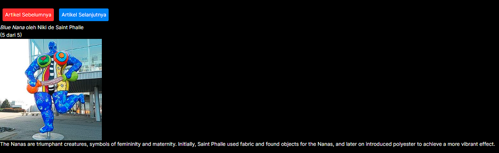

|  | Pemrograman Berbasis Framework 2024 |
| ----------- | --------- |
| NIM | 2141720266 |
| Nama | Alfan Marcel Mulyawan |
| Kelas | TI-3A |

# Jawaban Soal Praktikum 2
Fungsi Tombol_2 memiliki 2 parameter yaitu isiPesan dan namaTombol, pada bagian <b>page.tsx </b> pemanggilan <i>Tombol_2</i> diikuti dengan isi untuk kedua parameter, yaitu "Ini Pesanku" untuk parameter isiPesan dan nama tombol "Pesan" untuk parameter namaTombol

# Jawaban Soal Praktikum 4
 1. Jika kita menekan tombol "Artikel Selanjutnya" sebanyak 5x (atau melebihi halaman total artikel), apa yang akan terjadi?

 - maka akan terjadi error karena artikel yang ada hanya sebanyak 5 dan jika diklik lagi maka index akan melebihi jumlah banyak dari artikel

 2. Modifikasilah gallery.tsx agar bisa meng-handle permasalahan tersebut.

        function handleClick() {
            setIndex(index + 1);
            if ((index + 1)== sculptureList.length){
                setIndex(index);
            }
        }
    dengan menambahkan if dalam fungsi maka jika jumlah index+1 = panjang artikel, maka setIndex akan tetap sehingga tidak akan bertambah dan tidak terjadi error karena melebihi panjang artikel

3. Tambahkan tombol "Artikel Sebelumnya", untuk menampilkan artikel secara mundur.

        function downClick() {
                setIndex(index - 1);
                if ((index) == 0){
                    setIndex(index);
                }
            }
    menambahkan fungsi down click untuk tombol artikel sebelumnya dimana jika index = 0/ poisi di halaman pertama maka setIndex akan tetap sehingga nilai index tidak minus, kurang dari jumlah artikel, dan tidak error jika diklik artikel sebelumnya pada halaman pertama

# Jawaban Soal Praktikum 5
1. Apa perbedaan dari fungsi Form_2 yang pertama dengan yang kedua?

- Tidak ada perubahan dari fungsi yang pertama

2. Kenapa perlu menghapus state fullName? Apa keuntungannya?

- Untuk menghindari redundan dan bug pada aplikasi react

# Jawaban Soal Praktikum 6
1. Apa tujuan dari penulisan ini key={to.email} pada < Chat key={to.email} contact={to} / > ?

- Tujuan dari penulisan key={to.email} pada <Chat key={to.email} contact={to} /> adalah untuk memberikan React cara yang lebih efisien untuk mengidentifikasi setiap komponen dalam daftar yang diberikan.

2. Apa fungsi dari props key tersebut?

- Props key digunakan oleh React untuk membantu dalam proses reconcilation saat merender daftar komponen. Ketika React merender daftar komponen, setiap komponen yang ada dalam daftar tersebut harus memiliki kunci unik yang berbeda.